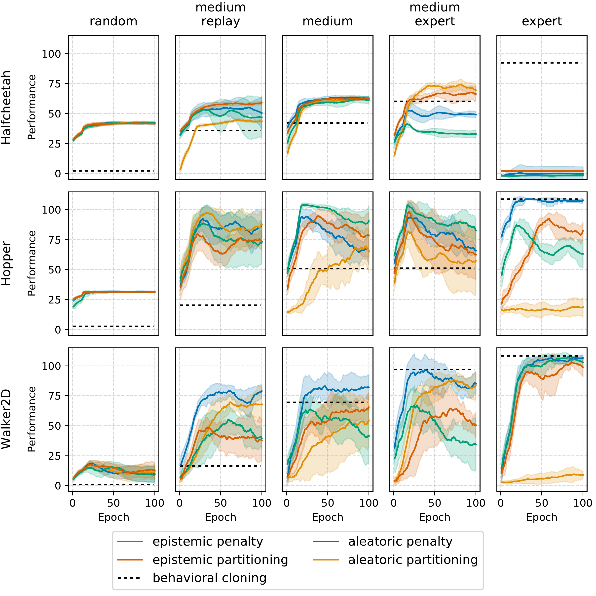

Installation
============

Install `Mujoco <https://mujoco.org/>`_ version 2.1.0

Clone the repository from Github and install the library with::

    git clone https://github.com/Mr-Pepe/offline-model-based-rl
    cd offline-model-based-rl
    pip install -e .

Configure default directories in the ``user config.py`` file or by setting the
``OMBRL_DATA_DIR`` and ``OMBRL_MODELS_DIR`` environment variables.

Overview
============

This library allows training model-free (`SAC <https://arxiv.org/abs/1801.01290>`_)
and model-based (`MBPO <https://bair.berkeley.edu/blog/2019/12/12/mbpo/>`_) reinforcement
learning (RL) agents in online and offline settings.
Offline training leverages the `D4RL <https://github.com/Farama-Foundation/d4rl>`_ benchmark datasets.
Currently, only the halfcheetah, walker-2d, and hopper datasets are supported for offline training.

Offline model-based training uses the concepts of pessimism proposed in
`MOPO <https://arxiv.org/abs/2005.13239>`_ and `MOReL <https://arxiv.org/abs/2005.05951>`_.
Similar to MBPO, both approaches train an environment model on an offline dataset and
use that model to generate synthetic data for training a model-free RL agent. However,
both approaches employ uncertainty estimation techniques to prevent distribution shift
by detecting areas where the model prediction quality can not be guaranteed.
The uncertainty estimate is either used to
penalize the predicted reward or to terminate trajectories when the uncertainty passes
a certain threshold. This library refers to the former as "penalty" (because of the
continuous reward penalty) and the latter as "partitioning" (because it partitions the
state-action space into certain and uncertain areas).

Different uncertainty estimation techniques can be used to determine the environment
model's uncertainty. This library implements the environment model as an ensemble of
probabilistic neural networks. The epistemic uncertainty can be estimated via the
ensemble, while the aleatoric uncertainty is estimated by each network in the ensemble.

This results in four different modes for offline model-based reinforcement learning:

    - Continuous reward penalization based on epistemic uncertainty estimation
    - Continuous reward penalization based on aleatoric uncertainty estimation
    - State-action space partitioning based on epistemic uncertainty estimation
    - State-action space partitioning based on aleatoric uncertainty estimation

The folllowing figure shows offline training performance of the approaches on the different datasets after hyperparameter tuning.
Read the next sections to learn how to reproduce those results.

   Training curves of offline MBRL methods based on state-action space partitioning or
   reward penalization by leveraging aleatoric or epistemic uncertainty estimates as
   model error estimators. Scores are normalized between 0 and 100 according to the D4RL
   benchmark, where a performance of 0 reflects a random policy and a performance of 100
   corresponds to an expert policy. Results are averaged over 6 random seeds and the
   colored areas represent one standard deviation. The performance of a behavioral
   cloning agent averaged over 6 seeds is displayed as a baseline for comparison.

Agent training
=================

The training loop is implemented in :py:mod:`offline_mbrl.train` and can be configured
via :py:class:`.TrainerConfiguration`. Check out the trainer configuration's documentation
to find out about all the configuration options you can use to customize the training.

Let's start with the most basic case of training an SAC agent online::

    python src/offline_mbrl/scripts/train_agent.py --env_name hopper-medium-replay-v2 --mode sac

Most values are taken from the default trainer configuration and you can adapt them to your needs.
You have to use one of the D4RL environment names although the offline dataset will not be used during online training.

You can observe the training process by running::

    tensorboard --logdir data/experiments/hopper-medium-replay-v2-sac/hopper-medium-replay-v2-sac-s0/

Open the displayed url in your browser.
Your agent should show some learning progress after 10-15 epochs.

Evaluate the agent performance by running::

    python src/offline_mbrl/scripts/evaluate_agent.py --env_name hopper-v2 --exp_path data/experiments/hopper-medium-replay-v2-sac/hopper-medium-replay-v2-sac-s0/

Model-based training
====================

You can visualize the training of an environment model consisting of an ensemble of probabilistic networks by running::

    python -m offline_mbrl.scripts.train_probabilistic_model_ensemble_on_toy_dataset

Make sure to install a graphical backend for matplotlib to see the animation.

Run the following to train an agent based on data generated by an environment model::

    python src/offline_mbrl/scripts/train_agent.py --env_name hopper-medium-replay-v2 --mode mbpo

The number of options explode when using an environment model.
How many networks should the ensemble have?
How many parameters should each network have?
How often should the model be trained?
For how long should it be trained?
How many samples should be generated from the environment model during each step of the training loop?
How many policy updates of the agent should be performed during each step of the training loop?
The large number of samples generated by the environment model for each training step should
allow you to increase the number of agent updates per step to improve sample efficiency of the training procedure.
Should existing samples from the virtual replay buffer be deleted?
They might be bad because they were generated by an old, less accurate version of the environment model.
How large should the virtual replay buffer be?
Making it smaller can also help to flush out old samples quickly without having to delete them after model training.

Using the default configuration will not yield great results compared to SAC.
You are in for a lot of fun playing around with all the parameters to get things to work well.

Offline training
================

Directly training an SAC agent on an offline dataset without interacting with the real environment
should not work well due to the distributional shift between the offline training data and the states
the agent will see in the real environment.
Nonetheless, it does work extremely well in some cases and you can try it by running::

    python src/offline_mbrl/scripts/train_agent.py --env_name hopper-medium-replay-v2 --mode offline-sac

For model-based approaches, you should consider training an environment model first and reusing it later.
Otherwise, you will have to train a new environment model for every training run although the offline dataset did not change.
Run the following to train an environment model::

    python src/offline_mbrl/scripts/train_environment_model.py --env_name hopper-medium-replay-v2

Then run any of the offline model-based approaches, for example::

    python src/offline_mbrl/scripts/train_agent.py --env_name hopper-medium-replay-v2 --mode aleatoric-partitioning

The script uses the hyperparameters for model pessimism and the out-of-distribution threshold as described in the following section.
They may or may not work well if you use a different agent or environment model configuration.

Hyperparameters
===============

This section describes how the hyperparameters from :py:mod:`.hyperparameters` were determined.
A number of hyperparameters can be tuned, ranging from the specific architectures of agent
and model networks to learning rates, batch sizes, the number and length of synthetic
rollouts, and the threshold and penalty weight for expressing pessimism.

The networks in the dynamics model ensemble contain four layers of 200 neurons each
and use rectified linear units (ReLUs) as activation functions. The reward model uses four
layers of 64 neurons and ReLUs. The reward and dynamics models are trained on 80% of
each dataset and validated on the remaining 20%. The validation error only contains the
mean-squared error between the predicted means and the real values. The training gets
stopped if the validation error does not decrease for a certain number of epochs. The number
of epochs depends on the dataset size and is 10 for the medium-expert datasets, 100 for the
medium-replay datasets, and 30 for all other datasets. A batch size of 256 and a learning rate
of 1e-3 are used to train all reward and dynamics models. All networks in the ensembles are
simultaneously trained on the same data batches but have different random initializations.

The agent networks for SAC and behavioral cloning have four layers of 128 neurons. All
agent networks use ReLUs as activation functions and are trained with a batch size of 256
and learning rates of 3e-4 for both policy and Q-value networks. The SAC agents are trained
for 500,000 update steps, while the behavioral cloning policies converge faster and are only
trained for 250,000 update steps.

The ratio of policy and Q-function gradient steps to the number of generated synthetic
samples can also be tuned. However, initial hyperparameter tuning showed that producing 50
samples per gradient update step showed good results across all trials. This hyperparameter
was therefore held constant, which leaves the synthetic rollout length and the pessimism
parameters to be tuned. Previous work only used very short rollouts of length up to five,
but using longer rollouts of up to 20 steps showed promising performance. The rollout length
was thus tuned for lengths between 1 and 20.

The epistemic and aleatoric uncertainty estimates were calculated for all the samples in each of the datasets,
to get a range of uncertainty estimates within a dataset.
The mean value and the standard deviation are usually orders of magnitude lower than
the maximum value. The threshold for the unknown state-action detector is thus tuned
by sampling from a logarithmic scale between the mean and the maximum value.
The penalty coefficient for continuous reward penalization is sampled
uniformly such that it lies in the range ``[0, R_max/uncertainty_max]``.
A maximum penalty coefficient would therefore lead to a penalty of R_max for the
samples in the dataset with the highest uncertainty.

Plot the results
================

Run the following to plot the results of your training::

    python src/offline_mbrl/scripts/plot.py data/experiments/

The plot in the overview section was produced by training agents for all approaches in all environments and then running::

    python src/offline_mbrl/scripts/plot.py data/experiments/ --final_eval true